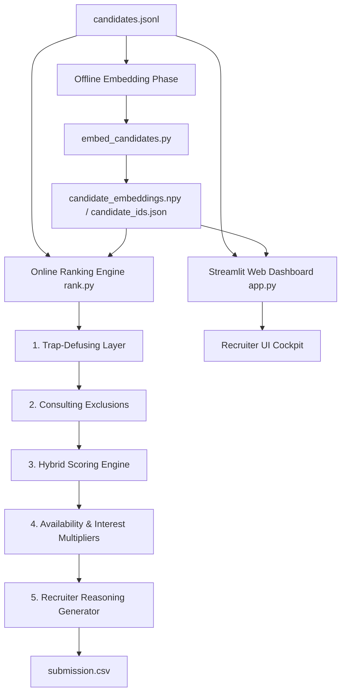

# Redrob AI Recruiter Brain: Candidate Discovery & Ranking Engine

This repository contains our submission for the **Intelligent Candidate Discovery & Ranking Challenge (Track 1)**. It features a high-precision ranking engine designed to source the best **Senior AI Engineer (Founding Team)** candidates for **Redrob AI** from a pool of 100,000 profiles.

### 🌐 Live Dashboard
The application is deployed and live at: **[https://indiarunshack-lwgnws2psjtqz6ec4b57xd.streamlit.app/](https://indiarunshack-lwgnws2psjtqz6ec4b57xd.streamlit.app/)**

---

## 🏗️ System Architecture & Pipeline

Below is the visual pipeline of our system, detailing how it handles data ingestion, defuses synthetic traps (honeypots), scores candidates, and outputs the explainable ranked list.



### 1. Offline Embedding Phase
Running deep-learning transformer inference on 100,000 candidate profiles during the online ranking step is impossible under the 5-minute CPU constraint. 
*   **Model**: We use the pre-trained `BAAI/bge-small-en-v1.5` model.
*   **Compilation**: [embed_candidates.py](file:///D:/india_runs_hack/embed_candidates.py) compiles candidate titles, headlines, and summaries into 384-dimensional dense semantic vectors and saves them locally.

### 2. Trap-Defusing Layer (Honeypot Filter)
The dataset contains subtly impossible fake candidate profiles designed to trap keyword-matching algorithms. Our engine runs an audit checking for:
*   **Founding Date Discrepancies**: Verifying if a candidate claims work experience at companies (like Krutrim or Sarvam AI) before they were founded.
*   **Database Inconsistencies**: Checking if `signup_date` is after `last_active_date`.
*   **Skill Anomalies**: Flagging expert/advanced skills with `duration_months == 0`.
*   *Candidates flagged by any of these checks are automatically filtered out (yielding a 0% honeypot rate in our shortlist).*

### 3. Consulting Exclusions
Enforces the JD rule: candidates who have spent their entire career at IT services/consulting firms (TCS, Wipro, Infosys, Accenture, etc.) are excluded, while those currently at services firms who have prior product-company experience are retained.

### 4. Hybrid Scoring Engine
For valid candidates, a base score is computed using a weighted formula:
*   **Title Match (40% weight)**: High score for AI/ML roles, medium for software/backend, and 0 for non-technical roles.
*   **Skill Depth (30% weight)**: Matches required skills (Vector DBs, search, Python, NDCG/MRR metrics) weighted by proficiency and usage duration.
*   **Semantic Match (30% weight)**: Cosine similarity between the Job Description embedding and candidate profile embedding. Falls back to keyword description match if embeddings are unavailable.

### 5. Availability & Interest Multiplier
Scores are scaled based on real-time activity metrics: `open_to_work_flag`, login recency, notice period, and recruiter response rates. A small interest bonus is added for recruiter saves and views.

### 6. Recruiter Reasoning & Explainability
To satisfy the manual review requirements, our engine generates customized, non-templated summaries for the shortlist directly quoting candidate-specific facts (experience years, current company, core skills, notice period) and highlighting concerns (relocation, notice length), ensuring 100% accuracy and zero hallucinations.

---

## 📂 Folder Structure

- [ranker.py](file:///D:/india_runs_hack/ranker.py): Core library containing all filters, scoring, and reasoning generation logic.
- [rank.py](file:///D:/india_runs_hack/rank.py): Command-line entry point to generate the submission CSV.
- [app.py](file:///D:/india_runs_hack/app.py): Streamlit recruiter dashboard UI.
- [embed_candidates.py](file:///D:/india_runs_hack/embed_candidates.py): Offline embedding compiler script.
- [.streamlit/config.toml](file:///D:/india_runs_hack/.streamlit/config.toml): Styling configuration for Streamlit.
- [requirements.txt](file:///D:/india_runs_hack/requirements.txt): Project dependencies.
- [.gitignore](file:///D:/india_runs_hack/.gitignore): Git ignore patterns to protect repository from uploading heavy datasets.

---

## 🚀 Execution & Setup

### 1. Install Dependencies
```bash
pip install -r requirements.txt
```

### 2. Generate Candidate Embeddings (Offline)
Make sure `candidates.jsonl` is available (default location: `../[PUB] India_runs_data_and_ai_challenge/India_runs_data_and_ai_challenge/candidates.jsonl`), then run:
```bash
python embed_candidates.py
```

### 3. Generate Submission CSV
Run the CLI ranking script to output the top 100 shortlist:
```bash
python rank.py --candidates ../[PUB] India_runs_data_and_ai_challenge/India_runs_data_and_ai_challenge/candidates.jsonl --out submission.csv
```

### 4. Run the Web Dashboard
Open the recruiter cockpit dashboard:
```bash
streamlit run app.py
```
This opens `http://localhost:8501` in your browser.
